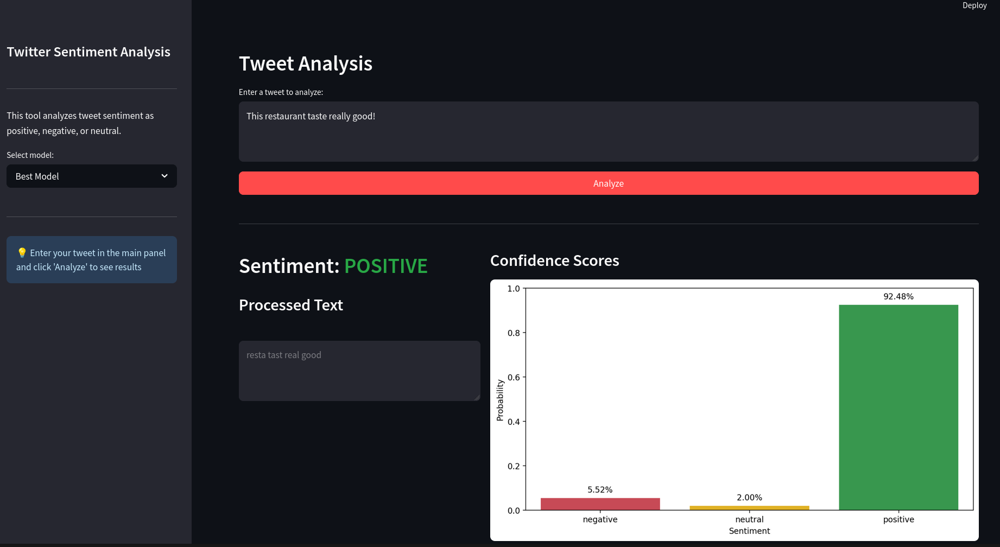
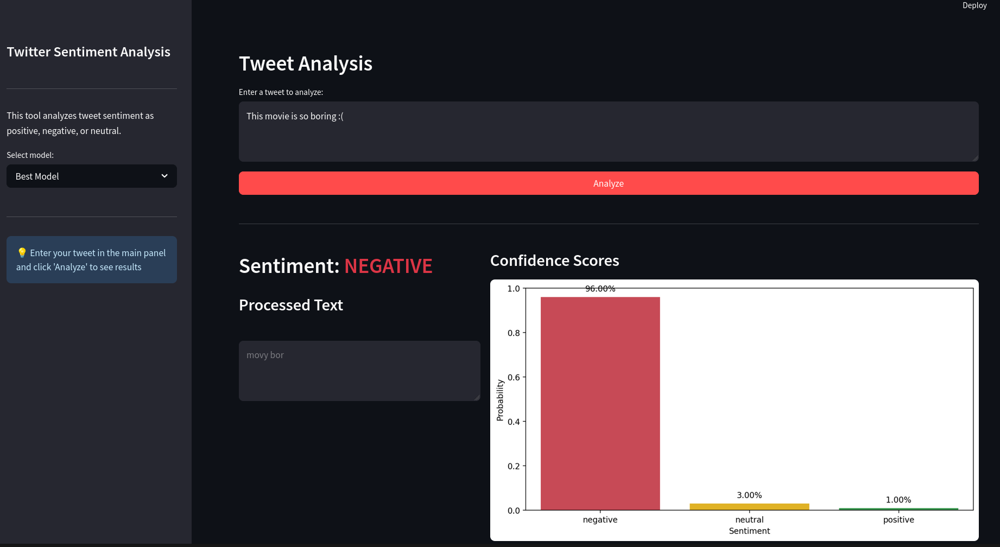

# Twitter Sentiment Analysis (CPE342 Mini Project)

## Overview
A machine learning system that classifies tweets as positive, negative, or neutral using natural language processing techniques. This project implements multiple classification models to analyze the emotional tone of social media text.

## Dataset
The dataset contains labeled tweets from [Kaggle](https://www.kaggle.com/datasets/abhi8923shriv/sentiment-analysis-dataset) 

The data includes tweet text, sentiment labels, and metadata such as time of posting, user demographics, and geographic information.

## Features
- Text preprocessing pipeline with tokenization, stopword removal, and stemming
- Multiple classification models (Naive Bayes, Logistic Regression, Random Forest)
- Model comparison and evaluation metrics
- Interactive web application for real-time sentiment analysis

## Web Application
The included Streamlit application provides an intuitive interface for sentiment analysis:

- Real-time tweet sentiment prediction
- Visualization of confidence scores
- Model selection capability
- Processed text display

## Getting Started
1. Clone the repository
2. Install dependencies: `pip install -r requirements.txt`
3. Run the training pipeline: `python -m sentiment_analysis.main`
4. Launch the web app: `streamlit run src/sentiment_analysis/app.py`

## Use Cases
- Brand reputation monitoring
- Customer feedback analysis
- Market research
- Social media trend analysis
- Political sentiment tracking
